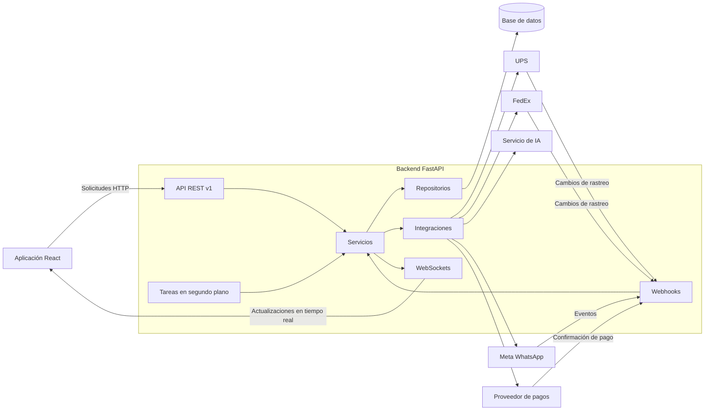
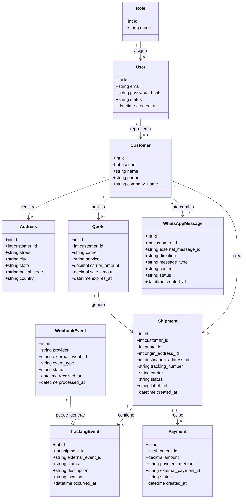
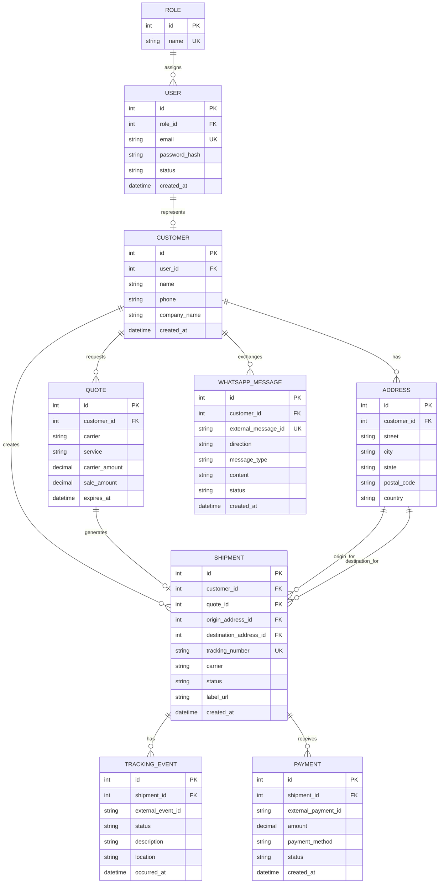
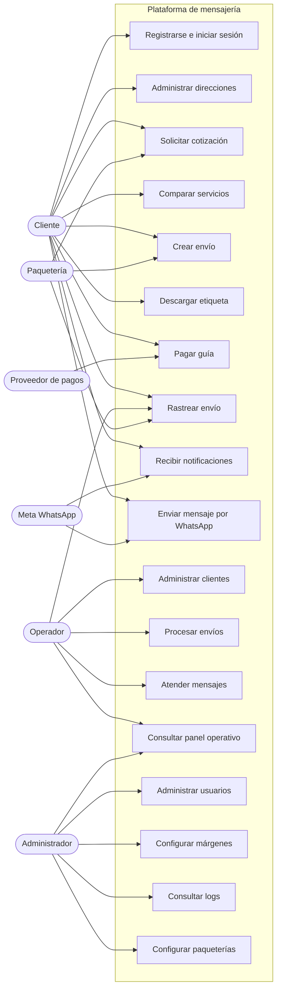
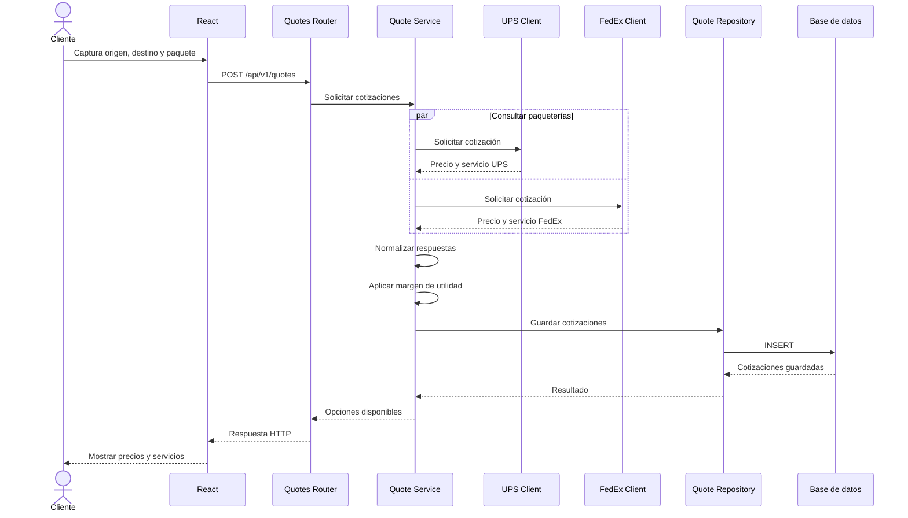
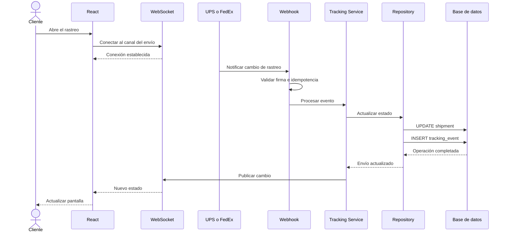
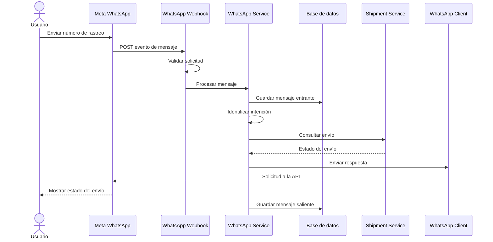
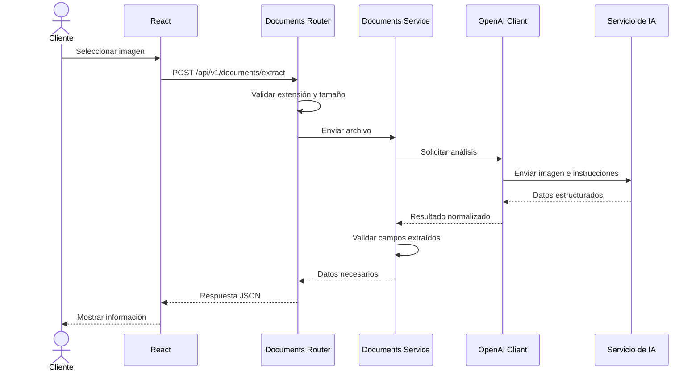

# Arquitectura del backend para plataforma de mensajería

## 1. Objetivo de la arquitectura

Esta arquitectura está diseñada para una plataforma de mensajería que permitirá:

- Registrar clientes y sus direcciones.
- Administrar usuarios, operadores y administradores.
- Solicitar cotizaciones de envíos.
- Comparar servicios de diferentes paqueterías.
- Crear guías de envío.
- Consultar el rastreo de los envíos.
- Recibir actualizaciones de las paqueterías mediante webhooks.
- Notificar cambios en tiempo real mediante WebSockets.
- Recibir y enviar mensajes mediante WhatsApp.
- Crear posteriormente un bot de WhatsApp.
- Procesar imágenes mediante servicios de inteligencia artificial.
- Administrar pagos por guía.
- Registrar eventos, errores y operaciones importantes.
- Mantener diferentes versiones de la API.

La estructura está organizada principalmente por funcionalidades de negocio.

Esto permite que todo lo relacionado con una funcionalidad, por ejemplo `shipments`, se encuentre dentro de la misma carpeta:

```text
shipments/
├── router.py
├── schemas.py
├── repository.py
└── service.py
```

De esta manera no es necesario navegar constantemente entre carpetas globales como `routers/`, `schemas/`, `repositories/` y `services/`.

---

# 2. Estructura de carpetas propuesta

```text
api_mensajeria/
│
├── alembic.ini                         -> Archivo principal de configuración de Alembic.
├── pyproject.toml                      -> Dependencias y configuración general del proyecto.
├── .env                                -> Variables de entorno locales. No debe subirse al repositorio.
├── .env.example                        -> Ejemplo de las variables necesarias para ejecutar el proyecto.
├── .gitignore                          -> Archivos y carpetas que Git debe ignorar.
├── README.md                           -> Documentación principal del proyecto.
│
├── app/                                -> Paquete principal del backend.
│   │
│   ├── __init__.py                     -> Indica que app es un paquete de Python.
│   ├── main.py                         -> Punto de entrada donde se crea la aplicación FastAPI.
│   │
│   ├── core/                           -> Elementos transversales utilizados por toda la aplicación.
│   │   ├── __init__.py
│   │   ├── config.py                   -> Variables de entorno y configuración con Pydantic Settings.
│   │   ├── database.py                 -> Engine, sesiones y configuración de SQLAlchemy.
│   │   ├── dependencies.py             -> Dependencias globales de FastAPI.
│   │   ├── exceptions.py               -> Excepciones personalizadas y manejadores globales.
│   │   ├── logging.py                  -> Configuración general de logs.
│   │   ├── security.py                 -> JWT, contraseñas, autenticación y autorización.
│   │   └── lifespan.py                 -> Procesos ejecutados al iniciar y cerrar la aplicación.
│   │
│   ├── models/                         -> Modelos ORM que representan las tablas de la base de datos.
│   │   ├── __init__.py                 -> Exporta los modelos para facilitar su importación.
│   │   ├── user.py                     -> Usuarios del sistema.
│   │   ├── role.py                     -> Roles y permisos.
│   │   ├── customer.py                 -> Clientes que realizan envíos.
│   │   ├── address.py                  -> Direcciones de remitentes y destinatarios.
│   │   ├── quote.py                    -> Cotizaciones obtenidas de las paqueterías.
│   │   ├── shipment.py                 -> Envíos y guías generadas.
│   │   ├── tracking_event.py           -> Historial de estados de un envío.
│   │   ├── payment.py                  -> Pagos realizados por los clientes.
│   │   ├── whatsapp_message.py         -> Mensajes entrantes y salientes de WhatsApp.
│   │   └── webhook_event.py            -> Registro de eventos recibidos mediante webhooks.
│   │
│   ├── api/                            -> Endpoints HTTP expuestos por el backend.
│   │   ├── __init__.py
│   │   │
│   │   └── v1/                         -> Primera versión pública de la API.
│   │       ├── __init__.py
│   │       ├── router.py               -> Une todos los routers pertenecientes a la versión 1.
│   │       │
│   │       ├── auth/                   -> Inicio de sesión, tokens y autenticación.
│   │       │   ├── __init__.py
│   │       │   ├── router.py           -> Endpoints de autenticación.
│   │       │   ├── schemas.py          -> Datos de entrada y salida de autenticación.
│   │       │   ├── repository.py       -> Consultas relacionadas con usuarios y autenticación.
│   │       │   └── service.py          -> Reglas para iniciar sesión y generar tokens.
│   │       │
│   │       ├── users/                  -> Administración de usuarios, operadores y administradores.
│   │       │   ├── __init__.py
│   │       │   ├── router.py
│   │       │   ├── schemas.py
│   │       │   ├── repository.py
│   │       │   └── service.py
│   │       │
│   │       ├── customers/              -> Administración de clientes.
│   │       │   ├── __init__.py
│   │       │   ├── router.py
│   │       │   ├── schemas.py
│   │       │   ├── repository.py
│   │       │   └── service.py
│   │       │
│   │       ├── addresses/              -> Direcciones de remitentes y destinatarios.
│   │       │   ├── __init__.py
│   │       │   ├── router.py
│   │       │   ├── schemas.py
│   │       │   ├── repository.py
│   │       │   └── service.py
│   │       │
│   │       ├── quotes/                 -> Cotizaciones de servicios de mensajería.
│   │       │   ├── __init__.py
│   │       │   ├── router.py
│   │       │   ├── schemas.py
│   │       │   ├── repository.py
│   │       │   └── service.py
│   │       │
│   │       ├── shipments/              -> Creación y administración de envíos y guías.
│   │       │   ├── __init__.py
│   │       │   ├── router.py
│   │       │   ├── schemas.py
│   │       │   ├── repository.py
│   │       │   └── service.py
│   │       │
│   │       ├── tracking/               -> Consulta del rastreo e historial de los envíos.
│   │       │   ├── __init__.py
│   │       │   ├── router.py
│   │       │   ├── schemas.py
│   │       │   ├── repository.py
│   │       │   └── service.py
│   │       │
│   │       ├── payments/               -> Creación, consulta y validación de pagos.
│   │       │   ├── __init__.py
│   │       │   ├── router.py
│   │       │   ├── schemas.py
│   │       │   ├── repository.py
│   │       │   └── service.py
│   │       │
│   │       ├── documents/              -> Recepción y procesamiento de imágenes o documentos.
│   │       │   ├── __init__.py
│   │       │   ├── router.py
│   │       │   ├── schemas.py
│   │       │   └── service.py
│   │       │
│   │       ├── webhooks/               -> Endpoints que reciben eventos de sistemas externos.
│   │       │   ├── __init__.py
│   │       │   ├── whatsapp.py         -> Eventos enviados por Meta WhatsApp.
│   │       │   ├── ups.py              -> Eventos de rastreo enviados por UPS.
│   │       │   ├── fedex.py            -> Eventos de rastreo enviados por FedEx.
│   │       │   └── payments.py          -> Confirmaciones enviadas por el proveedor de pagos.
│   │       │
│   │       ├── sockets/                -> Conexiones WebSocket para comunicación en tiempo real.
│   │       │   ├── __init__.py
│   │       │   ├── manager.py          -> Administra conexiones WebSocket activas.
│   │       │   ├── tracking.py         -> Envía actualizaciones de rastreo.
│   │       │   └── notifications.py    -> Envía notificaciones generales.
│   │       │
│   │       └── health/                 -> Verificación del estado de la aplicación.
│   │           ├── __init__.py
│   │           └── router.py           -> Endpoint health check para VPS, Docker o proxy.
│   │
│   ├── integrations/                   -> Clientes utilizados para consumir APIs externas.
│   │   ├── __init__.py
│   │   │
│   │   ├── carriers/                   -> Integraciones con empresas de mensajería.
│   │   │   ├── __init__.py
│   │   │   ├── base.py                 -> Interfaz común que deben implementar las paqueterías.
│   │   │   │
│   │   │   ├── ups/
│   │   │   │   ├── __init__.py
│   │   │   │   ├── client.py           -> Realiza solicitudes a la API de UPS.
│   │   │   │   ├── schemas.py          -> Modelos de datos propios de las respuestas de UPS.
│   │   │   │   ├── mapper.py           -> Convierte respuestas de UPS al formato interno.
│   │   │   │   └── exceptions.py       -> Errores específicos de la integración con UPS.
│   │   │   │
│   │   │   └── fedex/
│   │   │       ├── __init__.py
│   │   │       ├── client.py           -> Realiza solicitudes a la API de FedEx.
│   │   │       ├── schemas.py          -> Modelos de datos propios de FedEx.
│   │   │       ├── mapper.py           -> Convierte respuestas de FedEx al formato interno.
│   │   │       └── exceptions.py       -> Errores específicos de FedEx.
│   │   │
│   │   ├── ai/                         -> Integraciones con servicios de inteligencia artificial.
│   │   │   ├── __init__.py
│   │   │   └── openai/
│   │   │       ├── __init__.py
│   │   │       ├── client.py           -> Envía imágenes o instrucciones a OpenAI.
│   │   │       ├── schemas.py          -> Representa las respuestas esperadas.
│   │   │       ├── prompts.py          -> Instrucciones utilizadas para analizar documentos.
│   │   │       └── mapper.py           -> Normaliza los datos devueltos por la IA.
│   │   │
│   │   ├── messaging/                  -> Integraciones con plataformas de mensajería.
│   │   │   ├── __init__.py
│   │   │   └── whatsapp/
│   │   │       ├── __init__.py
│   │   │       ├── client.py           -> Envía mensajes utilizando la API de Meta.
│   │   │       ├── schemas.py          -> Modelos de mensajes enviados y recibidos.
│   │   │       ├── mapper.py           -> Convierte eventos de Meta al formato interno.
│   │   │       └── exceptions.py       -> Errores específicos de WhatsApp.
│   │   │
│   │   └── payments/                   -> Integraciones con proveedores de pagos.
│   │       ├── __init__.py
│   │       └── provider/
│   │           ├── __init__.py
│   │           ├── client.py           -> Crea cobros y consulta pagos.
│   │           ├── schemas.py          -> Modelos de solicitudes y respuestas del proveedor.
│   │           ├── mapper.py           -> Normaliza las respuestas del proveedor.
│   │           └── exceptions.py       -> Errores asociados con los pagos.
│   │
│   ├── jobs/                           -> Tareas programadas o procesos ejecutados en segundo plano.
│   │   ├── __init__.py
│   │   ├── tracking_sync.py            -> Consulta periódicamente el estado de envíos.
│   │   ├── webhook_retry.py            -> Reintenta el procesamiento de webhooks fallidos.
│   │   └── notification_sender.py      -> Envía notificaciones pendientes.
│   │
│   └── utils/                          -> Funciones pequeñas y genéricas sin reglas de negocio.
│       ├── __init__.py
│       ├── dates.py                    -> Funciones auxiliares para trabajar con fechas UTC.
│       ├── files.py                    -> Validación de archivos, extensiones y tamaños.
│       └── identifiers.py              -> Generación o validación de identificadores.
│
├── migrations/                         -> Migraciones de la base de datos administradas por Alembic.
│   ├── env.py
│   ├── script.py.mako
│   └── versions/
│
├── tests/                              -> Pruebas automatizadas.
│   ├── __init__.py
│   ├── conftest.py                     -> Fixtures y configuración compartida de pytest.
│   ├── unit/                           -> Pruebas aisladas de servicios y funciones.
│   ├── integration/                    -> Pruebas con BD o servicios simulados.
│   └── api/                            -> Pruebas de endpoints de FastAPI.
│
└── logs/                               -> Archivos de log generados por la aplicación.
```

---

# 3. Explicación de los bloques principales

## `app/main.py`

Es el punto de entrada de la aplicación.

Su responsabilidad principal es:

- Crear la instancia de FastAPI.
- Configurar el ciclo de vida de la aplicación.
- Registrar middlewares.
- Registrar manejadores de excepciones.
- Agregar los routers.
- Configurar CORS.
- Iniciar servicios necesarios.
- Definir información general de la API.

Ejemplo conceptual:

```python
app = FastAPI()

app.include_router(
    api_v1_router,
    prefix="/api/v1",
)
```

No debe contener consultas a la base de datos ni reglas de negocio.

---

## `app/core/`

Contiene elementos transversales utilizados por diferentes módulos.

Por ejemplo:

```text
core/
├── config.py
├── database.py
├── dependencies.py
├── exceptions.py
├── logging.py
├── security.py
└── lifespan.py
```

### `config.py`

Contiene la configuración obtenida de variables de entorno:

```text
DATABASE_URL
JWT_SECRET_KEY
UPS_CLIENT_ID
UPS_CLIENT_SECRET
FEDEX_CLIENT_ID
FEDEX_CLIENT_SECRET
WHATSAPP_ACCESS_TOKEN
WHATSAPP_VERIFY_TOKEN
OPENAI_API_KEY
```

### `database.py`

Contiene:

- El `engine` de SQLAlchemy.
- La clase base de los modelos.
- La fábrica de sesiones.
- La dependencia para entregar una sesión.

### `dependencies.py`

Contiene dependencias reutilizables como:

- Obtener la sesión de base de datos.
- Obtener el usuario autenticado.
- Verificar si el usuario es administrador.
- Validar permisos.
- Obtener el identificador de la empresa del usuario.

### `exceptions.py`

Contiene excepciones generales:

```python
class ResourceNotFoundError(Exception):
    pass


class ExternalServiceError(Exception):
    pass
```

También puede incluir los manejadores que convierten las excepciones en respuestas HTTP.

### `security.py`

Contiene:

- Hash de contraseñas.
- Verificación de contraseñas.
- Creación de JWT.
- Validación de JWT.
- Autenticación.
- Autorización por roles o permisos.

### `logging.py`

Configura qué eventos se registran y dónde se guardan.

Ejemplos:

- Errores inesperados.
- Solicitudes a paqueterías.
- Webhooks recibidos.
- Intentos de autenticación fallidos.
- Errores al crear una guía.
- Respuestas inválidas de servicios externos.

---

## `app/models/`

Contiene los modelos ORM de SQLAlchemy.

Cada modelo representa una tabla o una relación existente en la base de datos.

Ejemplos:

```text
UserORM
CustomerORM
AddressORM
QuoteORM
ShipmentORM
TrackingEventORM
PaymentORM
WebhookEventORM
WhatsAppMessageORM
```

Los modelos ORM no deberían encargarse de llamar APIs externas ni de responder solicitudes HTTP.

Su responsabilidad es representar y relacionar los datos persistidos.

---

## `app/api/v1/`

Contiene los módulos que forman la versión 1 de la API.

La URL podría comenzar así:

```text
/api/v1
```

Ejemplos:

```text
POST /api/v1/auth/login
GET  /api/v1/customers
POST /api/v1/quotes
POST /api/v1/shipments
GET  /api/v1/shipments/{shipment_id}
GET  /api/v1/tracking/{tracking_number}
POST /api/v1/documents/extract
```

El versionado permite que en el futuro se pueda agregar una versión diferente:

```text
/api/v2
```

sin eliminar inmediatamente la versión anterior que consumen los clientes.

---

# 4. Estructura interna de cada módulo

Un módulo de negocio normalmente contiene:

```text
shipments/
├── router.py
├── schemas.py
├── repository.py
└── service.py
```

## `router.py`

Recibe y valida la solicitud HTTP.

Sus responsabilidades son:

- Declarar la ruta.
- Recibir parámetros.
- Recibir el cuerpo de la solicitud.
- Aplicar dependencias.
- Llamar al servicio.
- Devolver la respuesta HTTP.

No debería contener reglas complejas del negocio.

Flujo:

```text
Solicitud HTTP
      ↓
router.py
      ↓
service.py
```

---

## `schemas.py`

Contiene modelos Pydantic para:

- Datos de entrada.
- Datos de salida.
- Parámetros internos.
- Validaciones básicas de formato.

Ejemplo conceptual:

```python
class ShipmentCreate(BaseModel):
    customer_id: int
    origin_address_id: int
    destination_address_id: int
    carrier: str
```

Los schemas de un módulo no son lo mismo que los modelos ORM.

```text
Schema Pydantic
    Representa datos de entrada o salida.

Modelo SQLAlchemy
    Representa una tabla de la base de datos.
```

---

## `repository.py`

Se comunica con la base de datos.

Sus responsabilidades son:

- Ejecutar consultas.
- Crear registros.
- Actualizar registros.
- Eliminar registros.
- Buscar registros.
- Trabajar con relaciones ORM.

Ejemplos conceptuales:

```text
get_shipment_by_id()
create_shipment()
update_shipment_status()
list_customer_shipments()
```

El repositorio no debería decidir si un cliente puede crear una guía ni calcular márgenes de utilidad. Esas son reglas del servicio.

---

## `service.py`

Contiene las reglas de negocio.

Este archivo coordina:

- Repositorios.
- Integraciones externas.
- Validaciones de negocio.
- Transacciones.
- Creación de cotizaciones.
- Cálculo de márgenes.
- Creación de guías.
- Cambios de estado.
- Notificaciones.

Ejemplo:

```text
Router
   ↓
QuoteService
   ├── valida la solicitud
   ├── consulta UPS
   ├── consulta FedEx
   ├── aplica margen
   ├── guarda las cotizaciones
   └── devuelve las opciones disponibles
```

---

# 5. Integraciones externas

La carpeta `integrations/` contiene los clientes utilizados por el backend para consumir otras APIs.

```text
integrations/
├── carriers/
├── ai/
├── messaging/
└── payments/
```

Una integración representa comunicación saliente:

```text
Nuestro backend
       ↓
Servicio externo
```

Ejemplos:

```text
FastAPI → UPS
FastAPI → FedEx
FastAPI → OpenAI
FastAPI → Meta WhatsApp
FastAPI → Proveedor de pagos
```

---

## Integraciones con paqueterías

```text
integrations/
└── carriers/
    ├── base.py
    ├── ups/
    └── fedex/
```

Cada paquetería puede tener una estructura como:

```text
ups/
├── client.py
├── schemas.py
├── mapper.py
└── exceptions.py
```

### `client.py`

Se encarga de efectuar las solicitudes HTTP a la paquetería:

- Obtener token.
- Solicitar cotización.
- Crear guía.
- Cancelar guía.
- Consultar rastreo.
- Obtener la etiqueta.

### `schemas.py`

Representa las solicitudes y respuestas específicas del proveedor.

Las respuestas de UPS pueden ser diferentes de las respuestas de FedEx, aunque ambas representen una cotización.

### `mapper.py`

Convierte la respuesta propia de la paquetería a un formato interno común.

Ejemplo:

```text
Respuesta de UPS
       ↓
UPS mapper
       ↓
CarrierQuote interno
```

```text
Respuesta de FedEx
       ↓
FedEx mapper
       ↓
CarrierQuote interno
```

Gracias a esto, el servicio de cotizaciones no necesita conocer todas las diferencias entre proveedores.

### `base.py`

Puede definir el comportamiento esperado para cualquier paquetería:

```text
authenticate()
get_quote()
create_shipment()
cancel_shipment()
get_tracking()
```

Esto permite agregar posteriormente otra paquetería sin modificar toda la aplicación.

---

## Integración con inteligencia artificial

```text
integrations/
└── ai/
    └── openai/
        ├── client.py
        ├── schemas.py
        ├── prompts.py
        └── mapper.py
```

Esta integración puede utilizarse para recibir una imagen desde el frontend y extraer información.

Ejemplos:

- Leer una etiqueta de envío.
- Extraer una dirección.
- Identificar un número de rastreo.
- Leer información de una factura.
- Extraer datos de un comprobante.
- Organizar los datos recibidos en un formato estructurado.

Flujo general:

```text
Cliente React
      ↓
POST /api/v1/documents/extract
      ↓
documents/router.py
      ↓
documents/service.py
      ↓
integrations/ai/openai/client.py
      ↓
Servicio de inteligencia artificial
      ↓
Respuesta estructurada
      ↓
Cliente React
```

El archivo `client.py` solamente debe conocer cómo comunicarse con el proveedor.

El archivo `documents/service.py` decide qué hacer con la información obtenida.

---

## Integración con WhatsApp

```text
integrations/
└── messaging/
    └── whatsapp/
        ├── client.py
        ├── schemas.py
        ├── mapper.py
        └── exceptions.py
```

Esta integración sirve para enviar información a Meta.

Ejemplos:

- Enviar mensajes.
- Enviar plantillas.
- Enviar una cotización.
- Enviar un número de rastreo.
- Enviar el enlace de una etiqueta.
- Informar que un envío fue entregado.
- Responder desde el bot.

Flujo de salida:

```text
Backend
   ↓
WhatsApp client
   ↓
API de Meta
   ↓
Usuario de WhatsApp
```

---

# 6. Resumen general de responsabilidades

```text
api/
    Lo que consume React y otros clientes HTTP.

router.py
    Recibe solicitudes y devuelve respuestas HTTP.

schemas.py
    Define y valida los datos de entrada y salida.

service.py
    Contiene y coordina las reglas del negocio.

repository.py
    Consulta y modifica la base de datos.

models/
    Representa las tablas y relaciones mediante SQLAlchemy.

integrations/
    Consume APIs o servicios externos.

webhooks/
    Recibe eventos enviados por sistemas externos.

sockets/
    Mantiene conexiones para enviar información en tiempo real.

jobs/
    Ejecuta tareas programadas o procesos en segundo plano.

core/
    Contiene configuración y elementos transversales.

tests/
    Contiene las pruebas automatizadas.

migrations/
    Contiene los cambios versionados de la base de datos.
```

---

# 7. Diferencia entre una API externa y un webhook

## Consumo de una API externa

Nuestro sistema inicia la comunicación.

```text
Nuestro backend
       ↓
API externa
```

Ejemplos:

```text
FastAPI → UPS para solicitar una cotización.
FastAPI → FedEx para crear una guía.
FastAPI → OpenAI para analizar una imagen.
FastAPI → Meta para enviar un mensaje.
FastAPI → Proveedor de pagos para crear un cobro.
```

Estas operaciones pertenecen a:

```text
app/integrations/
```

---

## Recepción de un webhook

El servicio externo inicia la comunicación.

```text
Servicio externo
       ↓
Nuestro backend
```

Ejemplos:

```text
Meta → FastAPI cuando llega un mensaje.
UPS → FastAPI cuando cambia el estado de un envío.
FedEx → FastAPI cuando se entrega un paquete.
Proveedor de pagos → FastAPI cuando se confirma un pago.
```

Estas operaciones pertenecen a:

```text
app/api/v1/webhooks/
```

---

# 8. ¿Qué es un webhook?

Un webhook es un endpoint HTTP que permite que un sistema externo notifique a nuestro backend que ocurrió un evento.

Sin webhook, nuestro sistema tendría que preguntar constantemente:

```text
¿Cambió el envío?
¿Ya pagó el cliente?
¿Llegó un mensaje?
¿La guía fue entregada?
```

Con un webhook, el sistema externo nos avisa:

```text
El envío cambió de estado.
El pago fue aprobado.
Llegó un mensaje.
La guía fue entregada.
```

Normalmente se recibe mediante una petición `POST`.

Ejemplos conceptuales:

```text
POST /api/v1/webhooks/whatsapp
POST /api/v1/webhooks/ups
POST /api/v1/webhooks/fedex
POST /api/v1/webhooks/payments
```

Un webhook debe:

1. Verificar que la solicitud sea legítima.
2. Registrar el evento recibido.
3. Evitar procesar el mismo evento más de una vez.
4. Responder rápidamente al proveedor.
5. Procesar tareas pesadas en segundo plano.
6. Registrar los errores.
7. Permitir reintentos si el procesamiento falla.

---

# 9. Ejemplo de webhook de WhatsApp

Cuando un usuario envía un mensaje al bot:

```text
Usuario de WhatsApp
        ↓
Meta WhatsApp
        ↓
POST /api/v1/webhooks/whatsapp
        ↓
Validar la solicitud
        ↓
Guardar el mensaje
        ↓
Interpretar la intención
        ↓
Consultar información
        ↓
Enviar una respuesta con WhatsApp client
```

Para WhatsApp se necesitan dos partes:

```text
api/v1/webhooks/whatsapp.py
    Recibe mensajes y eventos enviados por Meta.

integrations/messaging/whatsapp/client.py
    Envía mensajes hacia Meta.
```

La comunicación sucede en ambas direcciones:

```text
Meta → webhook → nuestro backend
Nuestro backend → client → Meta
```

---

# 10. Ejemplo de webhook de una paquetería

Cuando una paquetería informa un cambio:

```text
UPS o FedEx
      ↓
Webhook de la paquetería
      ↓
Buscar el envío
      ↓
Registrar TrackingEvent
      ↓
Actualizar Shipment
      ↓
Notificar al cliente
```

Ejemplo de cambio:

```text
CREATED
   ↓
PICKED_UP
   ↓
IN_TRANSIT
   ↓
OUT_FOR_DELIVERY
   ↓
DELIVERED
```

No todas las paqueterías utilizan los mismos nombres de estado.

Por eso el `mapper.py` de cada integración puede traducirlos a estados internos:

```text
Estado de UPS
      ↓
UPS mapper
      ↓
Estado estándar de la aplicación
```

---

# 11. ¿Qué es un WebSocket?

Un WebSocket permite mantener una conexión abierta entre el cliente y el servidor.

En HTTP tradicional:

```text
Cliente → Solicitud → Servidor
Cliente ← Respuesta ← Servidor
```

Después de la respuesta, la comunicación termina.

Con WebSocket:

```text
Cliente ↔ Servidor
```

La conexión permanece abierta y el servidor puede enviar información sin esperar una nueva solicitud del cliente.

La carpeta propuesta es:

```text
app/api/v1/sockets/
├── manager.py
├── tracking.py
└── notifications.py
```

---

# 12. Casos para utilizar WebSockets

## Rastreo en tiempo real

Un operador puede permanecer en la pantalla de un envío.

Cuando llega una actualización:

```text
Paquetería
     ↓
Webhook
     ↓
ShipmentService
     ↓
Base de datos
     ↓
WebSocket
     ↓
React
```

React puede actualizar la pantalla sin recargarla.

---

## Panel de operaciones

El panel administrativo puede recibir:

- Nuevas solicitudes de cotización.
- Nuevos envíos.
- Pagos confirmados.
- Errores de paqueterías.
- Mensajes nuevos de WhatsApp.
- Cambios de rastreo.
- Envíos entregados.

---

## Chat de WhatsApp dentro del sistema

Si un operador está atendiendo una conversación:

```text
Usuario envía mensaje por WhatsApp
              ↓
Meta envía el webhook
              ↓
Backend guarda el mensaje
              ↓
WebSocket notifica a React
              ↓
El operador ve el mensaje
```

Cuando el operador responde:

```text
React
   ↓
Endpoint del backend
   ↓
WhatsApp service
   ↓
WhatsApp client
   ↓
Meta
   ↓
Usuario de WhatsApp
```

---

# 13. Webhook y WebSocket trabajando juntos

Un webhook y un WebSocket no son lo mismo.

```text
Webhook
    Permite que un servicio externo se comunique con el backend.

WebSocket
    Permite que el backend se comunique en tiempo real con React.
```

Ejemplo completo:

```text
UPS detecta un cambio
        ↓
UPS llama al webhook
        ↓
El backend actualiza la base de datos
        ↓
El backend publica el cambio por WebSocket
        ↓
React actualiza la pantalla
```

Otro ejemplo:

```text
Usuario envía un WhatsApp
        ↓
Meta llama al webhook
        ↓
El backend guarda el mensaje
        ↓
El backend notifica mediante WebSocket
        ↓
El operador ve el mensaje nuevo
```

---

# 14. Tareas en segundo plano

Algunas operaciones no deberían ejecutarse completamente dentro de una solicitud HTTP.

Ejemplos:

- Consultar periódicamente números de rastreo.
- Reintentar un webhook que falló.
- Enviar correos.
- Enviar notificaciones de WhatsApp.
- Descargar etiquetas.
- Procesar archivos grandes.
- Analizar imágenes.
- Generar reportes.
- Limpiar registros temporales.

Estas operaciones pueden colocarse en:

```text
app/jobs/
```

Al inicio se pueden utilizar tareas en segundo plano de FastAPI para procesos pequeños.

Cuando el proyecto crezca, se puede incorporar una cola de tareas con un worker independiente.

---

# 15. Seguridad de los webhooks

No se debe confiar automáticamente en cualquier solicitud que llegue a un endpoint de webhook.

Se recomienda:

1. Verificar firmas o tokens enviados por el proveedor.
2. Utilizar HTTPS.
3. Guardar el identificador externo del evento.
4. Evitar procesar eventos duplicados.
5. No registrar tokens ni datos sensibles en logs.
6. Responder con rapidez.
7. Procesar operaciones pesadas fuera de la solicitud.
8. Validar el contenido con schemas.
9. Registrar la fecha de recepción y procesamiento.
10. Mantener estados como `received`, `processed` y `failed`.

El modelo `WebhookEventORM` podría guardar:

```text
id
provider
external_event_id
event_type
payload
status
received_at
processed_at
error_message
attempts
```

El campo `external_event_id` puede tener una restricción única para evitar duplicados.

---

# 16. Diagramas Mermaid

Para visualizar correctamente los siguientes diagramas, el visor Markdown debe tener soporte para Mermaid.

---

## 16.1 Diagrama general de componentes



---

## 16.2 Diagrama UML de clases

Este diagrama representa una versión inicial de las entidades principales del proyecto.



---

## 16.3 Diagrama entidad-relación



> Nota: una relación entre `Address` y `Shipment` se utiliza dos veces, una para la dirección de origen y otra para la dirección de destino. Al crear los modelos ORM será necesario indicar explícitamente las llaves foráneas de cada relación.

---

## 16.4 Diagrama de casos de uso



---

## 16.5 Flujo para crear una cotización



---

## 16.6 Flujo de rastreo con webhook y WebSocket



---

## 16.7 Flujo del bot de WhatsApp



---

## 16.8 Flujo para analizar una imagen



---

# 17. Estrategia recomendada para migrar la estructura actual

La estructura actual es:

```text
alembic/
app/
├── config/
├── db/
├── dependencies/
├── entities/
├── middlewares/
├── repositories/
├── routers/
├── schemas/
├── security/
└── services/
main.py
logs/
```

La migración se puede realizar gradualmente.

## Paso 1: mover el punto de entrada

```text
main.py
```

se convierte en:

```text
app/main.py
```

---

## Paso 2: crear `core/`

Mover gradualmente:

```text
config/          → app/core/config.py
db/              → app/core/database.py
dependencies/    → app/core/dependencies.py
security/        → app/core/security.py
```

Los middlewares pueden registrarse desde `main.py` o mantenerse en una carpeta independiente si existen varios:

```text
app/middlewares/
```

---

## Paso 3: cambiar `entities/` por `models/`

```text
app/entities/
```

se convierte en:

```text
app/models/
```

Este cambio es principalmente de organización y nombre.

---

## Paso 4: migrar un módulo a la vez

En lugar de mover todo al mismo tiempo, se recomienda iniciar con un módulo.

Por ejemplo, `shipments`.

Mover:

```text
routers/shipment.py
schemas/shipment.py
repositories/shipment.py
services/shipment.py
```

hacia:

```text
api/v1/shipments/
├── router.py
├── schemas.py
├── repository.py
└── service.py
```

Después se puede repetir con:

```text
customers
addresses
quotes
tracking
payments
users
auth
```

---

## Paso 5: crear las integraciones

Las llamadas HTTP a servicios externos deben trasladarse a:

```text
app/integrations/
```

Ejemplos:

```text
Llamadas a UPS       → integrations/carriers/ups/client.py
Llamadas a FedEx     → integrations/carriers/fedex/client.py
Llamadas a OpenAI    → integrations/ai/openai/client.py
Llamadas a Meta      → integrations/messaging/whatsapp/client.py
Llamadas de pagos    → integrations/payments/provider/client.py
```

---

## Paso 6: agregar los webhooks

Crear:

```text
app/api/v1/webhooks/
```

Comenzar con el webhook que se necesite primero, probablemente WhatsApp:

```text
app/api/v1/webhooks/whatsapp.py
```

Posteriormente agregar:

```text
ups.py
fedex.py
payments.py
```

---

## Paso 7: agregar WebSockets cuando exista un caso real

No es obligatorio implementar WebSockets desde el inicio.

Primero puede funcionar el sistema con endpoints HTTP.

WebSockets pueden agregarse cuando se necesite:

- Rastreo visible en tiempo real.
- Chat de WhatsApp para operadores.
- Notificaciones en el panel administrativo.
- Actualizaciones automáticas de pagos.
- Nuevos envíos en tiempo real.

---

# 18. Recomendaciones adicionales

## Evitar duplicar schemas innecesariamente

Los schemas del dominio deben vivir junto al módulo:

```text
api/v1/shipments/schemas.py
```

Los schemas que representan directamente respuestas de UPS deben vivir en:

```text
integrations/carriers/ups/schemas.py
```

Son responsabilidades diferentes.

---

## No devolver respuestas externas directamente

No se recomienda devolver directamente a React la respuesta completa de UPS, FedEx, Meta o OpenAI.

La respuesta debe transformarse a un modelo interno.

```text
Respuesta externa
       ↓
Mapper
       ↓
Modelo interno
       ↓
Schema de respuesta
       ↓
React
```

Esto evita que el frontend dependa del formato específico de un proveedor.

---

## Utilizar fechas UTC

Las fechas internas deben guardarse preferentemente en UTC:

```text
created_at
updated_at
received_at
processed_at
occurred_at
```

La conversión a la zona horaria del usuario puede realizarse al presentar la información.

---

## Mantener idempotencia en webhooks

Un proveedor puede enviar el mismo evento varias veces.

Por eso es recomendable guardar:

```text
provider
external_event_id
```

y aplicar una restricción única compuesta.

Conceptualmente:

```text
UNIQUE(provider, external_event_id)
```

Así un evento de UPS y uno de Meta podrían tener el mismo identificador sin entrar en conflicto, pero el mismo evento del mismo proveedor no se procesaría dos veces.

---

## Mantener secretos fuera del código

Nunca colocar directamente dentro del código:

```text
Tokens
Contraseñas
API keys
Client secrets
JWT secrets
Credenciales de la base de datos
```

Deben administrarse mediante variables de entorno.

---

## No guardar archivos grandes directamente en la base de datos

Para etiquetas, comprobantes o imágenes se recomienda guardar:

- La ruta del archivo.
- La URL.
- El identificador del almacenamiento.
- Los metadatos.

La base de datos puede conservar la referencia, pero no necesariamente todo el contenido binario.

---

# 19. Conclusión

La arquitectura propuesta separa claramente quién inicia cada comunicación:

```text
React → API REST → Backend
Backend → Integrations → Servicios externos
Servicios externos → Webhooks → Backend
Backend → WebSockets → React
Jobs → Services → Procesos en segundo plano
Services → Repositories → Base de datos
```

La regla general para ubicar el código será:

```text
Si recibe una solicitud de React:
    api/v1/<modulo>/router.py

Si contiene una regla de negocio:
    api/v1/<modulo>/service.py

Si consulta o modifica la base de datos:
    api/v1/<modulo>/repository.py

Si define datos de entrada o salida:
    api/v1/<modulo>/schemas.py

Si representa una tabla:
    models/

Si nuestro backend llama a otro sistema:
    integrations/

Si otro sistema llama a nuestro backend:
    api/v1/webhooks/

Si el backend debe notificar en tiempo real a React:
    api/v1/sockets/

Si debe ejecutarse periódicamente o en segundo plano:
    jobs/

Si es una configuración utilizada por toda la aplicación:
    core/
```

Esta estructura permite comenzar con módulos pequeños y agregar progresivamente paqueterías, pagos, automatizaciones, Inteligencia Artificial, WhatsApp, webhooks y comunicación en tiempo real sin desordenar el resto del proyecto.